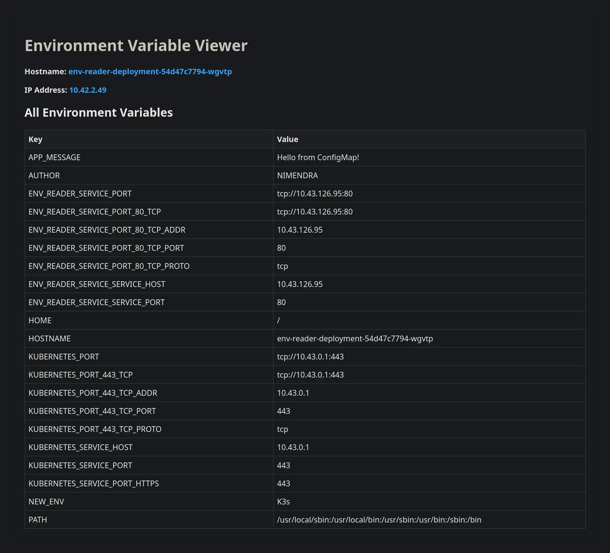
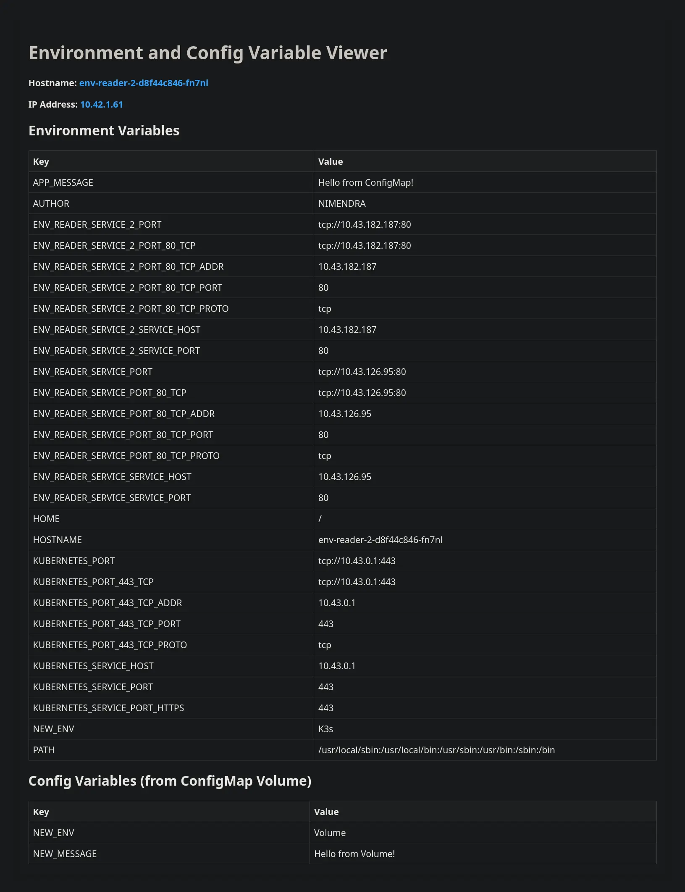

## ConfigMap

> [Updating Configuration via a ConfigMap](https://kubernetes.io/docs/tutorials/configuration/updating-configuration-via-a-configmap/)

> [!IMPORTANT]
> Although the value of the **key inside the ConfigMap has changed, the environment variable in the Pod still shows the earlier value**. This is because environment variables for a process running inside a Pod are **not** updated when the source data changes; if you wanted to force an update, you would need to have Kubernetes replace your existing Pods. The new Pods would then run with the updated information.

**Solutions**:

1. Use `kubectl rollout restart`

This will cause the pods to reload with the new environment variables and configuration.

Files:
- [Deployment](./deployment.yaml)
- [ConfigMap](./configmap.yaml)
- [NodePort Service](./service.yaml)
```bash
kubectl rollout restart deployment <deployment-name>
```



2. Use `envFrom` to Load ConfigMap as Volume

If you want to have more flexibility and allow the pod to pick up updates from the `ConfigMap` without a restart, you can mount the `ConfigMap` as a volume.

Files:
- [Deployment](./deployment-2.yaml)
- [ConfigMap](./configmap-2.yaml)
- [NodePort Service](./service-2.yaml)


