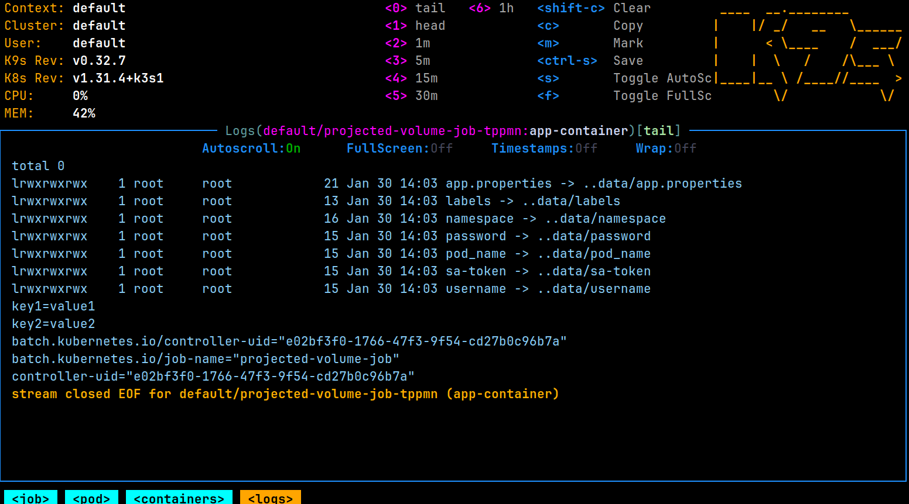

## Downward API

> [!IMPORTANT]
> Downward API: [mkdev.me/posts/what-is-kubernetes-downward-api-and-why-you-might-need-it](https://mkdev.me/posts/what-is-kubernetes-downward-api-and-why-you-might-need-it)
## Projected Volume

Projected volume allows to combine multiple volume sources into a single directory.
**Usage**: 
- Aggregate data from different sources, such as **Secrets, ConfigMaps, Downward API, and ServiceAccount tokens**, into a unified location.

> https://kubernetes.io/docs/concepts/storage/projected-volumes/

