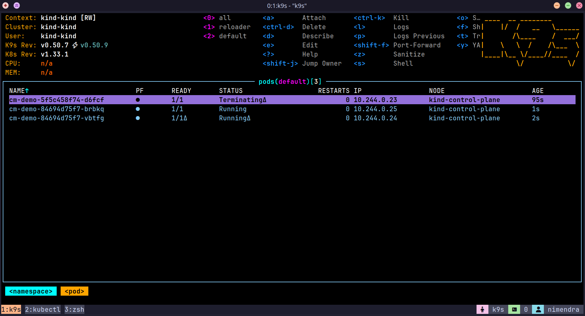
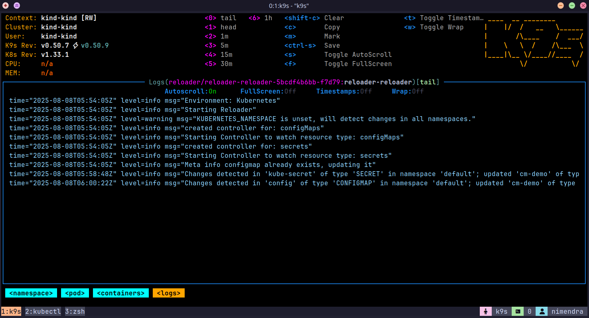

## Reloader 

Reloader watches changes in ConfigMaps and Secrets and automatically restarts Kubernetes Deployments, StatefulSets, or DaemonSets that reference them.

### Generate configmap using `kubectl`

```bash 
kubectl create configmap app-config --from-file=./demo-app/config.json
```

We can check generated configmap using following command.

```bash
kubectl get configmap app-config -o yaml
```
--- 

### Load docker image using kind

```bash
kind load docker-image nimendra/cmdemo:2.0.2
```

### Install Reloader 

```bash
helm repo add stakater https://stakater.github.io/stakater-charts

helm repo update

# List chart versions
helm search repo stakater/reloader -l

# Get latest chart version
CHART_VERSION=$(helm search repo reloader | awk 'NR==2 { print $2 }')

helm install reloader stakater/reloader \
--create-namespace \
--namespace reloader \
--version $CHART_VERSION \
--values ./reloader/values.yaml
```

## Screenshots

<figure>
  
  <figcaption><b>Figure 1:</b> K9s Dashboard showing restart pod after the config map change</figcaption>
</figure>

<figure>
  
  <figcaption><b>Figure 2:</b> Reloader logs showing detecting configmap and secret changes</figcaption>
</figure>

## Error Logs 

### Error: ImagePullBackOff (Kind Cluster)

```text
Warning  Failed     xx  kubelet  Error: ErrImagePull
Normal   BackOff    xx  kubelet  Back-off pulling image "ghcr.io/stakater/reloader:v1.4.6"
Warning  Failed     xx  kubelet  Error: ImagePullBackOff
```

#### Cause

This issue occurs because `kind` clusters do not automatically pull images from remote registries like `ghcr.io`. The image must be manually loaded into the local Docker registry that `kind` uses.

> Reference: [kind issue #3663](https://github.com/kubernetes-sigs/kind/issues/3663)

#### Solution

1. **Pull the required image manually:**

```bash
docker pull ghcr.io/stakater/reloader:v1.4.6
```

2. **Load the image into your `kind` cluster:**

```bash
kind load docker-image ghcr.io/stakater/reloader:v1.4.6
```

3. **Ensure your `values.yaml` or Helm command uses the exact same image tag:**

```yaml
image:
  repository: ghcr.io/stakater/reloader
  tag: v1.4.6
```
## Extras

### Generate Base64 encoded string for Secrets

This command copy string to system clipboard. 
```bash
echo -n 'whydoialwaysforget' | base64 | xclip -sel clip
```


